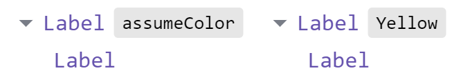

import {Unstyled} from "@storybook/blocks"
import {pipe, String} from 'effect'
import {mapProps, assume, assumeProp, modProp, unionVariants} from 'react-compinators'

<Unstyled>

<h1><span style={{fontFamily: 'Times New Roman, Times, serif'}}>λ⚛</span> React Compinators Tutorial</h1>

<ol>
  <li><a href="#props"><code>Props</code></a></li>
  <ol>
    <li><a href="#1-assume"><code>assume</code></a> (<a href="https://middle-ages.github.io/react-compinators-docs/docs/functions/assume.html">API</a>)</li>
    <li><a href="#2-assumeprop"><code>assumeProp</code></a> (<a href="https://middle-ages.github.io/react-compinators-docs/docs/functions/assumeProp.html">API</a>)</li>
    <li><a href="#3-unionvariants"><code>unionVariants</code></a> (<a href="https://middle-ages.github.io/react-compinators-docs/docs/functions/unionVariants.html">API</a>)</li>
    <li><a href="#4-modprop"><code>modProp</code></a> (<a href="https://middle-ages.github.io/react-compinators-docs/docs/functions/modProp.html">API</a>)</li>
    <li><a href="#5-mapprops"><code>mapProps</code></a> (<a href="https://middle-ages.github.io/react-compinators-docs/docs/functions/mapProps.html">API</a>)</li>
  </ol>
  <li><a href="#a-note-about-displayname">A note about <code>displayName</code></a></li>
</ol>

A simple label component we will use as a running example:
```tsx
export const COLORS = ['red', 'yellow', 'green'] as const
export type Color = (typeof COLORS)[number]

interface LabelProps { text: string; color: Color }

const Label = ({text, color: background}: LabelProps) => (
  <div style={{background}}>{text}</div>
)

<Label text="Green"  color="green" />
<Label text="Yellow" color="yellow" />
<Label text="Red"    color="red" />
```

export const COLORS = ['red', 'yellow', 'green']
export const Label = ({text, color: background}) => (
  <div style={{background, textAlign: 'center'}}>{text}</div>
)

<fieldset>
<legend>Three Labels</legend>
<Label text="Green"  color="green" />
<Label text="Yellow" color="yellow" />
<Label text="Red"    color="red" />
</fieldset>

## Props

### 1. `assume`

To partially apply a subset of the `<Label>` props, we can use
`assume`(_base_)(partial props):
```tsx
import {assume} from 'react-compinators'

const YellowLabel = assume(Label)({color: 'yellow'})

<YellowLabel text="Hello World!" />

console.log(YellowLabel.displayName) // assumeColor(Label)
```

export const YellowLabel1 = assume(Label)({color: 'yellow'})

<fieldset>
<legend>assumeColor(Label)</legend>
<YellowLabel1 text="Hello World!" />
</fieldset>

#### `displayName`

By default, the `displayName` shown in React Dev Tools will be
`assumeColor(Label)`, because `Label` is the `displayName` of the base component
and we are partially applying a single prop called `color`.

The combinators in this library will let you set an optional `displayName` to
aid debugging, but having none, will try to compute a reasonable value from
their arguments.

To override the `displayName` _wrapper_ we can provide the second, optional
argument to `assume`:

```tsx
import {assume} from 'react-compinators'

const YellowLabel = assume(Label)({color: 'yellow'}, 'Yellow')
//                                                       ↑
//                  Optional argument for displayName wrapper 

<YellowLabel text="Hello World!" />

console.log(YellowLabel.displayName) // Yellow(Label)
```
export const YellowLabel2 = assume(Label)({color: 'yellow'}, 'Yellow')

<fieldset>
<legend>Yellow(Label)</legend>
<YellowLabel2 text="Hello World!" />
</fieldset>

Here is how it looks in React Dev Tools with a default (`assumeColor`) vs.
custom `displayName` (`Yellow`):



All combinators follow this pattern of taking an optional value that will
determine `displayName`.

### 2. `assumeProp`

When you need to partially apply only a single prop, `assumeProp` is a simpler
variant of `assume`. Note that it too takes an optional `displayName` argument:

```tsx
import {assumeProp} from 'react-compinators'

const YellowLabel = assumeProp(Label, 'color')('yellow', 'My')

<YellowLabel text="Hello World!" />

console.log(YellowLabel.displayName) // My(Label)
```

export const YellowLabel3 = assumeProp(Label, 'color')('yellow', 'My')

<fieldset>
<legend>My(Label)</legend>
<YellowLabel3 text="Hello World!" />
</fieldset>

### 3. `unionVariants`

What if we wanted to partially apply _three_ variants of the button, one for
each color?
```tsx
import {assume} from 'react-compinators'

const GreenLabel  = assume(Label)({color: 'green'})
const YellowLabel = assume(Label)({color: 'yellow'})
const RedLabel    = assume(Label)({color: 'red'})

<RedLabel    text="Red"/>
<YellowLabel text="Yellow"/>
<GreenLabel  text="Green"/>
```

export const GreenLabel4 = assume(Label)({color: 'green'})
export const YellowLabel4 = assume(Label)({color: 'yellow'})
export const RedLabel4 = assume(Label)({color: 'red'})

<fieldset>
<legend>Calling <code>assume</code> <i>three</i> times</legend>
<GreenLabel4  text="Green"/>
<YellowLabel4 text="Yellow"/>
<RedLabel4    text="Red"/>
</fieldset>

We could loop over the values, or we could use the `unionVariants` combinator.
It supports the common use case of creating a _variant per union member_, useful
when we prefer _more components but less props_, over _less props but more
components_:
```tsx
import {String} from 'effect'
import {unionVariants} from 'react-compinators'

const [ GreenLabel, YellowLabel, RedLabel ] = unionVariants(
  Label,             // Base component.
  'color',           // Prop that we will be setting.
)(
  COLORS,            // Array of union members.
  String.capitalize, // Optional function will be used to compute variant
                     // displayName from its `color` prop.
) 

<RedLabel    text="Red"/>
<YellowLabel text="Yellow"/>
<GreenLabel  text="Green"/>

console.log(YellowLabel.displayName) // Yellow(Label)
```

export const [GreenLabel5, YellowLabel5, RedLabel5] = unionVariants(
  Label, 'color',
)(
  COLORS,
  String.capitalize,
) 

<fieldset>
<legend><code>unionVariants</code></legend>
<GreenLabel5  text="Green"/>
<YellowLabel5 text="Yellow"/>
<RedLabel5    text="Red"/>
</fieldset>

### 4. `modProp`

`modProp` is used to map over a component prop without changing its type.The
returned component will be of the same type as the base component.

Useful for example to add a CSS class to the a component without creating a new
component or changing the component props at its call site. In this case it would
act like `assume`, except instead of fixing a prop value, we are _adding_ fixed
value to the prop.

Here we convert our label into one that appends a question mark to the text:

```tsx
import {String, pipe} from 'effect'
import {modProp} from 'react-compinators'

const QuestionLabel: typeof Label = pipe('?', String.concat, modProp(Label, 'text'))

<QuestionLabel color="yellow" text="Hello World" />

console.log(QuestionLabel.displayName) // mapPropText(Label)
```

export const QuestionLabel = pipe('?', String.concat, modProp(Label, 'text'))

<fieldset>
<legend><code>modPropText(Label)</code></legend>
<QuestionLabel color="yellow" text="Hello World" />
</fieldset>

### 5. `mapProps`

When:
 
1. You have a component that takes props of type `A`.
2. But you want a component that takes props of type `B`.
3. And the props you have are of type `B`.
4. But you do have some way of converting `B` ⇒ `A`.
 
 For example lets convert a component that display a number into a component
 that displays character count for a given string:
 
 ```tsx
 import {mapProps} from 'react-compinators'
 interface B { foo: string }
 interface A { bar: number }
 
 const ComponentA: FC<A> = ({ bar }) => <div>{bar + 1}</div>;
 
 // The function mapping B ⇒ A
 const mapper = (a: B): A => ({ bar: a.foo.length })
 
 // We now have a component of B
 const ComponentB: FC<B> = pipe(ComponentA, mapProps(mapper));

 <ComponentB foo="foo">
 ```
export const ComponentA = ({bar}) => <div>{bar.toString()}</div>
export const mapper = (a) => ({bar: a.foo.length})
export const ComponentB = pipe(ComponentA, mapProps(mapper));

<fieldset>
<legend><code>mapProps(ComponentA)</code></legend>
<ComponentB foo="Hello World!" />
</fieldset>


## A note about `displayName`

`displayName` is used mostly for debugging via [React Dev
Tools](https://react.dev/learn/react-developer-tools). The convention for HOCs is:
```text
Original Component Name
            ↓   
   Yellow(Label)
      ↑
  HOC Name
```

Read more about React Dev Tools and HOCs
[here](https://github.com/facebook/react/blob/main/packages/react-devtools/CHANGELOG.md#higher-order-components).

</Unstyled>
